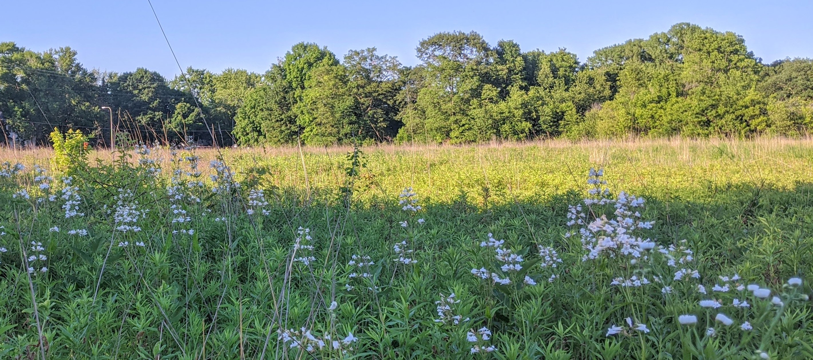

 

   

I am an evolutionary ecologist broadly interested in understanding the evolution of host-microbe symbioses. My work aims to integrate the molecular processes that underlie these host-microbe interactions with fundamental ecological and evolutionary theory in order to understand the outcome of these interactions.

I am currently an Arts & Science Postdoctoral Fellow with [Megan Frederickson](http://mutualism.ca/) in the Department of Ecology and Evolutionary Biology at the University of Toronto and I completed my PhD with [Anthony Yannarell](https://nres.illinois.edu/directory/acyann) at the University of Illinois. 

<b>
<b>

See [here](cv.pdf) for my CV.
