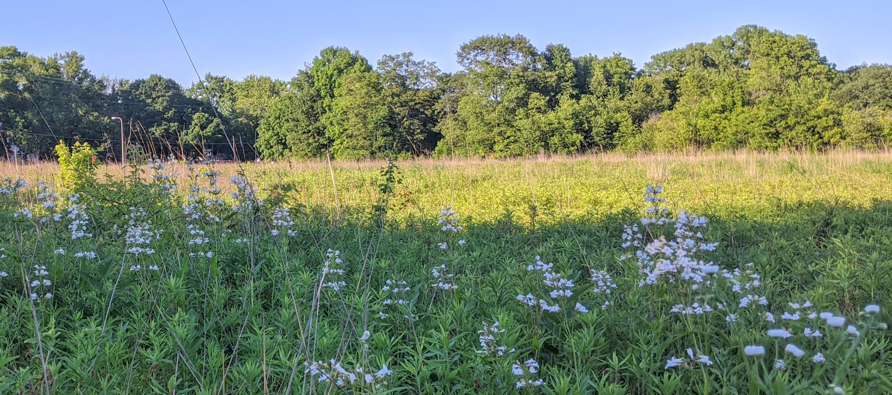

 

   

I am an ecologist studying how microbial symbioses shape plant population and community responses to global change. Plant populations do not persist or spread on their own: their demography and competitive ability are shaped by interactions with microbial partners. Yet we know remarkably little about how these microbes impact plant ecological outcomes at population and landscape scales. My research fills this gap using quantitative, mechanistic approaches. Namely, I use experimental systems, genomics, and functional biogeography, to link plant-microbe dynamics to plant fitness, competition, and range shifts.

I am currently a Postdoctoral Fellow with [Megan Frederickson](http://mutualism.ca/) in the Department of Ecology and Evolutionary Biology at the University of Toronto and I completed my PhD with [Anthony Yannarell](https://nres.illinois.edu/directory/acyann) at the University of Illinois. 

<b>
<b>

See [here](cv.pdf) for my CV.
