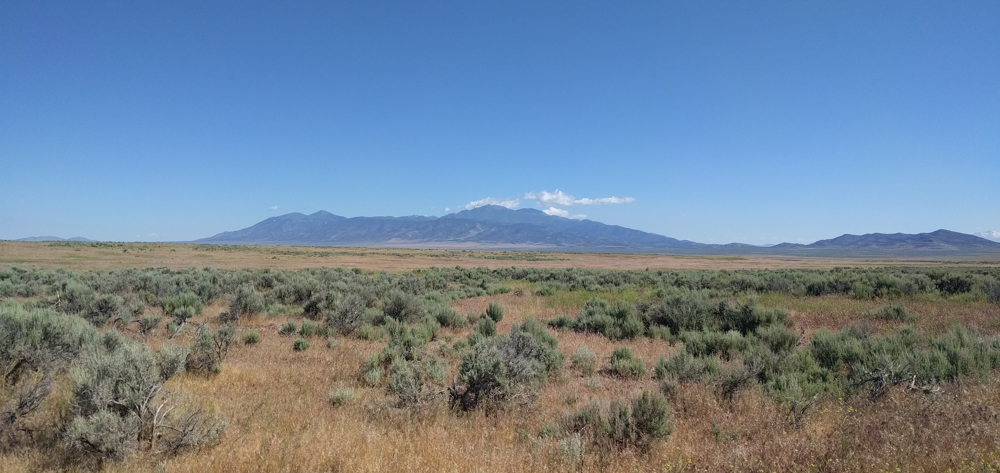

My latest publications can be found in my [Google Scholar page](https://scholar.google.com/citations?user=9KlgDVMAAAAJ&hl=en). Please let me know if you would like a PDF of any articles.

### Published

**Ricks KD**, Ricks NJ, & Yannarell AC (2023). Patterns of plant salinity adaptation depend on interactions with soil microbes. The American Naturalist. [doi.org/10.1086/725393](https://www.journals.uchicago.edu/doi/10.1086/725393)

**Ricks KD** & Yannarell AC (2023). Soil moisture incidentally selects for microbes that facilitate locally adaptive plant response. Proceedings of the Royal Society, B. [doi.org/10.1098/rspb.2023.0469](https://royalsocietypublishing.org/doi/10.1098/rspb.2023.0469)

Nettles R, **Ricks KD**, & Koide RT (2020). The dynamics of antibiotic-induced dysbiosis in interacting bacterial and fungal communities of the mouse colon. Microbial Ecology. [doi.org/10.1007/s00248-020-01525-6](https://link.springer.com/article/10.1007/s00248-020-01525-6)

**Ricks KD** & Koide RT. (2019). The role of inoculum dispersal and plant species identity in the assembly of leaf endophytic fungal communities. PLOS ONE. [https://doi.org/10.1371/journal.pone.0219832](https://journals.plos.org/plosone/article?id=10.1371/journal.pone.0219832)

**Ricks KD** & Koide RT (2019). Biotic filtering of endophytic fungal communities in <i>Bromus tectorum</i>. Oecologia. [doi.org/10.1007/s00442-019-04388-y](https://link.springer.com/article/10.1007/s00442-019-04388-y)

Koide RT, Nguyen BT, Skinner RH, Dell CJ, Adler PR, Drohan PJ, Peoples MS, Licht M, Boyer M. Nettles R, **Ricks KD**, & Watkins J (2018). Comparing biochar application methods for switchgrass yield and C sequestration on contrasting marginal lands in Pennsylvania, USA. BioEnergy Research. [doi.org/10.1007/s12155-018-9940-1](https://link.springer.com/article/10.1007/s12155-018-9940-1)

Koide RT, **Ricks KD**, & Davis ER (2017). Climate and dispersal influence the structure of leaf fungal endophyte communities of <i>Quercus gambelii</i> in the eastern Great Basin, USA. Fungal Ecology. [doi.org/10.1016/j.funeco.2017.08.002](https://www.sciencedirect.com/science/article/abs/pii/S1754504817300971?via%3Dihub)

Koide RT, Watkins J, **Ricks KD**, … & Clark E (2017). Site and tree factors determining the distribution of <i>Phellinus tremulae</i> in <i>Populus</i> tremuloides in Utah, USA. Canadian Journal of Forest Research. [doi.org/10.1139/cjfr-2017-0323](https://cdnsciencepub.com/doi/10.1139/cjfr-2017-0323)

Nettles R, Watkins J, **Ricks KD**, … & Koide RT (2016). Influence of pesticide seed treatments on rhizosphere fungal and bacterial communities and leaf fungal endophyte communities in maize and soybean. Applied Soil Ecology. [doi.org/10.1016/j.apsoil.2016.02.008](https://www.sciencedirect.com/science/article/abs/pii/S0929139316300427?via%3Dihub)

Szink I, Davis EL., **Ricks KD**, & Koide RT (2016). New evidence for broad trophic status of leaf endophytic fungi of <i>Quercus gambelii</i>. Fungal Ecology. [doi.org/10.1016/j.funeco.2016.04.003](https://www.sciencedirect.com/science/article/abs/pii/S1754504816300253?via%3Dihub)

